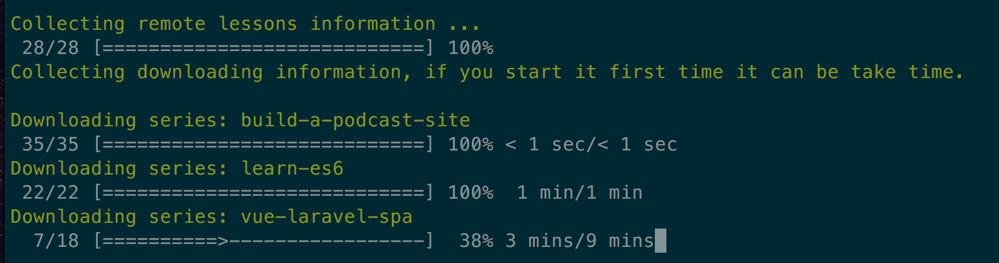

# Codecourse Downloader
Download codecourse.com videos.

## Description
Inspired from iamfreee/laracasts-downloader. Download or update your local catalogue with codecourse.com series.

#### An account with an active subscription is necessary!

## Requirements
- PHP >= 5.4
- php-cURL
- php-xml
- Composer

## Installation
- Clone this repo to a folder in your machine
- Change your info in .env.example and rename it to .env
- `composer install`
- `php codecourse download` and you are done!
